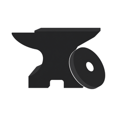

  

# Forge

A focused, private strength-training tracker for iPhone, built in SwiftUI. Forge is
meant to feel like a well-made tool: quick to operate between sets, calm to look at,
and careful with your data.

<!-- Screenshots go here. -->

## What Forge is for

Forge tracks weightlifting workouts and nothing else. It is built around a few priorities:

- Fast to operate during a workout, including one-handed and while tired.
- Private by default. Workout data stays on the device.
- Reliable when interrupted by a call, the screen locking, or the app being closed.
- Native to iOS, using standard controls and behaviour.

There are no accounts, no ads, and no tracking. It is not a social network, a coach,
or a subscription.

## Features

- Log a workout as a scroll of exercise cards, each with its set table inline
  (previous result, weight, reps), so logging never leaves the screen.
- Rest timer with a configurable alert sound and haptic, and a Lock Screen notification.
- Routines and plans to start a workout from a template, with drag-to-reorder exercises.
- History with each exercise's previous sessions, a date-range filter, and workout detail.
- Next-session targets that pre-fill the weight the next time you do an exercise.
- Set types (drop set, failure), plus per-set and per-exercise notes.
- Optional personal-record markers and RPE, both off by default.
- Light, dark, or system appearance.
- Custom exercises, backup, and export (JSON and a full database file).
- Dynamic Type, VoiceOver labels, and Reduce Motion support.

## Privacy

Forge stores workouts locally. It requires no account, includes no analytics or
advertising SDKs, and sends nothing off the device unless you deliberately export it.

## Use of AI

Forge is developed with heavy use of an AI coding assistant (Claude Code). The assistant
writes and edits the code under human direction. Every change is built on CI
before it is merged, and the maintainer reviews behaviour and design. Treat the codebase
as AI-assisted work that is human-reviewed, not unchecked generation.

## Building

The Xcode project is generated with XcodeGen from `project.yml` (the `.xcodeproj` is not
checked in). You need a recent Xcode and iOS 16 or later.

- Install XcodeGen (for example, `brew install xcodegen`).
- Run `xcodegen generate` in the repository root to create `Forge.xcodeproj`.
- Open the project, select the `Forge` target, and set a unique bundle identifier under
  Signing & Capabilities.
- Select your development team, then build the `Forge` scheme.

CI builds the app on a macOS runner on every push.

## License and attribution

Forge is derived from the open-source [Iron](https://github.com/kabouzeid/Iron) workout
tracker by Karim Abou Zeid, and is released under the same GNU General Public License v3.0.
See [LICENSE](LICENSE). Upstream copyright notices are preserved.
